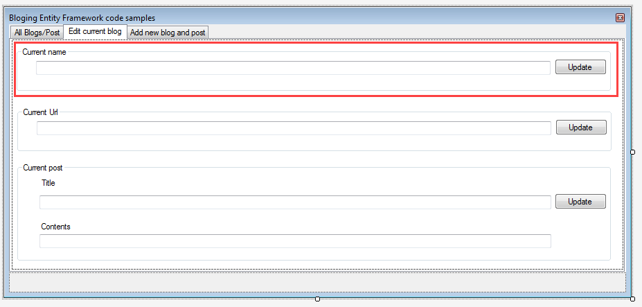
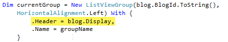

# Model modification

## Introduction
In the previous article models were generated by Visual Studio adding a new item to the backend class project which scaffold tables in the SQL-Server database. One drawback from newcomers to Entity Framework using this approach is that the models and DbContext can not be regenerated. By regenerated means using the same steps to create the models and DbContext will overwrite the existing code which is okay only if there is no customization while if there is customization e.g. annotated columns in one or more models or customized the DbContext they will be lost. 

## Options

One method to update the models and DbContext without overwriting existing code is to create a temporary project, run the process to create models and context then copy changes to the existing project. If going this route a recommendation is to create a new branch in source control so if something goes wrong changes can be rolled back to the working version prior to making changes.

As one becomes familiar with working with models and context simply coding the changes without the assistance of creating a new project is going to be easier.

## Example

### Modifying the database
Working with the blog model, currently there is a primary key and Url property, a blog name is needed now. Since the chosen approach has been working with an existing database, using [SSMS](https://docs.microsoft.com/en-us/sql/ssms/sql-server-management-studio-ssms?view=sql-server-ver15) open the table definition for the Blog table, add a new field, BlogName as shown below for the new definition of the Blog table.

```sql
[BlogId] [int] IDENTITY(1,1) NOT NULL,
[Url] [nvarchar](max) NULL,
[BlogName] [nvarchar](max) NULL,
```

### Update the model

**Step 1** is to add a property for BlogName column.

```vb
Public Property BlogName As String
```
Next the desire is to display the blog name and url in as the group name in the ListView, to do this add a readonly property to the Blog model.  
```vb
Public ReadOnly Property Display() As String
    Get
        Return $"{BlogName}: {Url}"
    End Get
End Property
```
**Step 2** On the second tab of the form, duplicate one of the group boxes. Provide proper names for the TextBox and label along with a group box title. This is all available in the [GitHub repository](https://github.com/karenpayneoregon/ef6-basic-crud-vb/tree/model-changed).



**Step 3** In the code to display data in the ListView alter the code as shown below from blog.Url to blog.Display..


**Step 3** Add the following for changing the name of the blog button click event.

```vb
Private Sub UpdateBlogNameButton_Click(sender As Object, e As EventArgs) _
    Handles UpdateBlogNameButton.Click

    Dim blog As Blog = _context.Blogs.Find(CType(CurrentUrlTextBox.Tag, PostTag).BlogId)
    blog.BlogName = CurrentBlogNameTextBox.Text

    '
    ' Update database - note there is no assertion of empty value
    '
    _context.SaveChanges()

    '
    ' Update ListView
    '
    BlogListView.SelectedItems(0).Group.Header = blog.Display

End Sub
```

**Step 4** Change the last line in UpdateUrlButton.Click from 

```vb
BlogListView.SelectedItems(0).Group.Header = blog.Url
```

To

```vb
BlogListView.SelectedItems(0).Group.Header = blog.Display
```

Run the project and test to ensure all works properly.

# Summary

In this example there are several takeaways, first, a property for blog name should had been considered when creating the database tables which in turn would had avoided having to alter the model, the second  takeaway is requirements change, this is unavoidable so it would be prudent to take time and practice modifying models and context before working on a project rather than doing this during a project.


