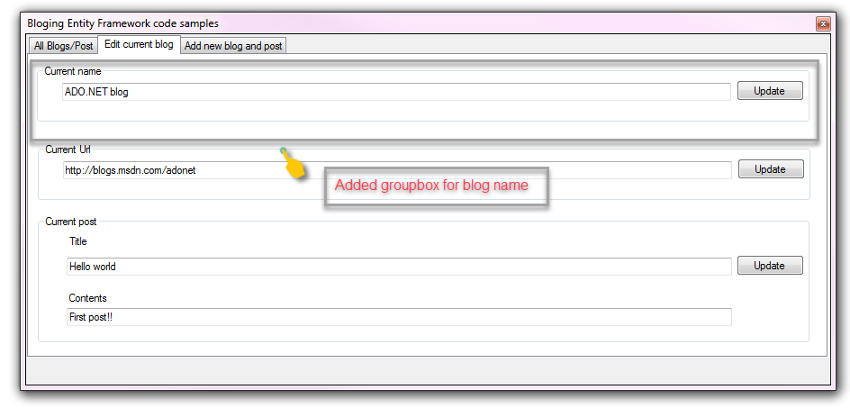

# Entity Framework (VB.NET) - getting started part 3
This is the next part of a series starting with Microsoft TechNet article [Entity Framework 6 basic data operations (VB.NET) Windows Forms](https://social.technet.microsoft.com/wiki/contents/articles/53700.entity-framework-6-basic-data-operations-vb-net-window-forms.aspx) and [GitHub repository](https://github.com/karenpayneoregon/ef6-basic-crud-vb/tree/master).

In this part of the series performing simple modifications to the model will be discussed.

**Unpublished todate**

**Requires**
SQL-Server installed, Visual Studio 2017 or higher

**Main screen**

**Edit tab**

**Add tab**

